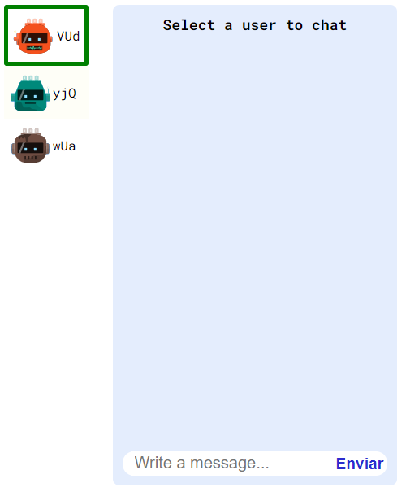
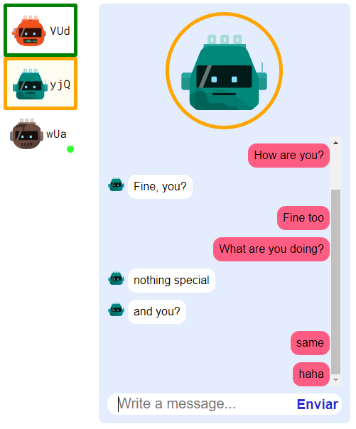
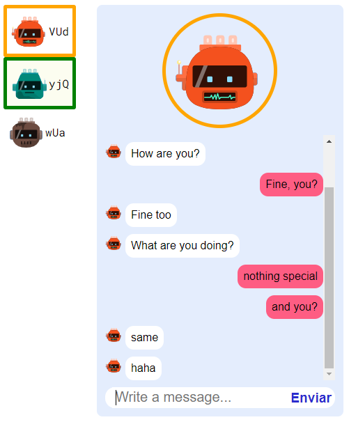

# ChatApp

A nice looking app that allows you to chat privately with multiple users at the same time. The app shows you in the sidebar if you have unread messages from a certain user.

The backend of this app is [here](https://github.com/grcwork/chat-app-server)

## Tech stack used to build this app

### Frontend

    - Angular
    - TypeScript
    - socket.io-client
    - RxJS
    - HTML
    - CSS

### Backend

    - Node.js
    - Socket.IO
    - Express

### Screenshots

<table>
    <tr>
        <td></td>
        <td></td>
        <td></td>
    </tr>
</table>

